# Deep Learning Object Detection Model Comparative Analysis

This repository contains a comparative analysis of multiple deep learning object detection models with image enhancement modules attached. The objective of this analysis is to evaluate the performance of these models in adverse Weather conditions.
 

## Methodology
```
                                             TO BE ADDED
```

## Datasets

The following datasets were used for the comparative analysis:

- [RTTS](https://drive.google.com/file/d/16xuZv5KKGLm-k4qgi-MRkrdYQxhQZrWR/view?usp=share_link)

## Evaluation Metrics

The following evaluation metrics were used for the comparative analysis:

- mAP@0.5
- f1 score

## [Models](https://drive.google.com/drive/folders/1SAlW2ZZjwZHpjudHtsBn6_bmaMAMVqoE?usp=share_link)

### Detection Modules

The following deep learning object detection models were evaluated:

- [YOLOv3](https://arxiv.org/pdf/1804.02767.pdf)
- [YOLOv6](https://arxiv.org/pdf/2209.02976.pdf)
- [YOLOv7](https://arxiv.org/pdf/2207.02696.pdf)

### Image Enhancement Modules

The following image enhancement modules were evaluated:

- [DENet](https://openaccess.thecvf.com/content/ACCV2022/papers/Qin_DENet_Detection-driven_Enhancement_Network_for_Object_Detection_under_Adverse_Weather_ACCV_2022_paper.pdf)
- [TransWeather](https://arxiv.org/pdf/2111.14813.pdf)


## Results

### Plots
<table>
    <tr>
        <th>Batch Ground Truth</th>
        <th>Batch Detection Results</th>
        <th>PR_Curve</th>
        <th>F1_Curve</th>
    </tr>

    <tr>
        <td colspan="4"> YoloV3 </td>
    </tr>
    <tr>
        <td></td>
        <td></td>
        <td>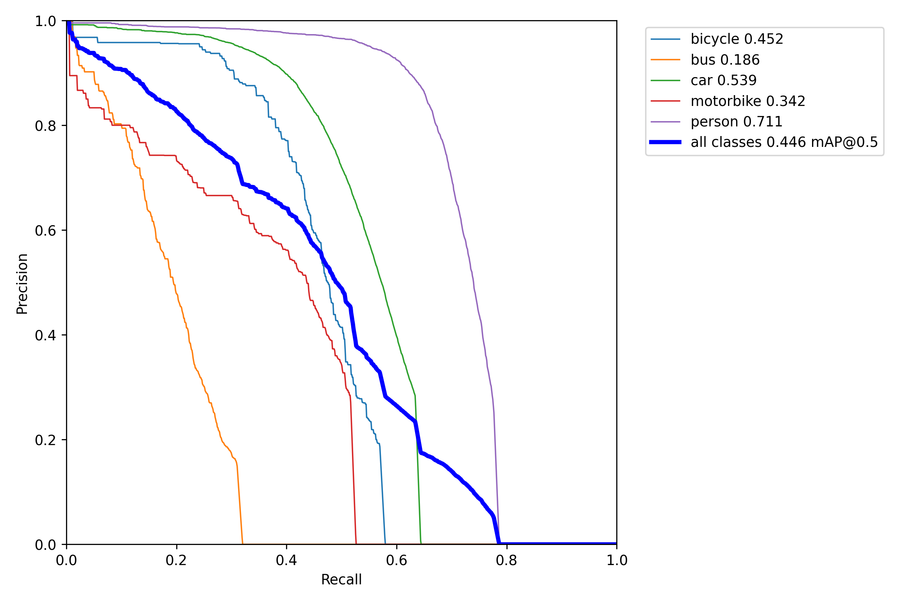</td>
        <td>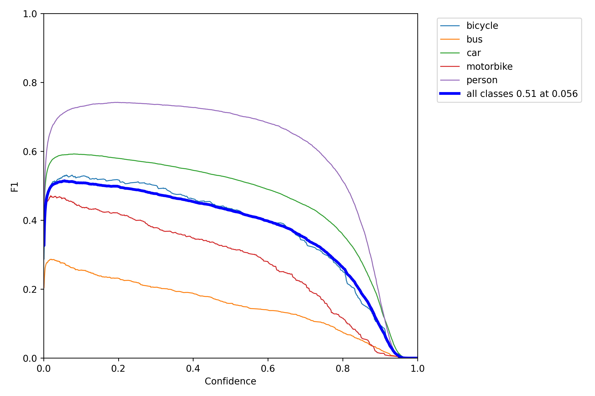</td>
    </tr>

    <tr>
        <td colspan="4"> DEYoloV3 </td>
    </tr>
    <tr>
        <td>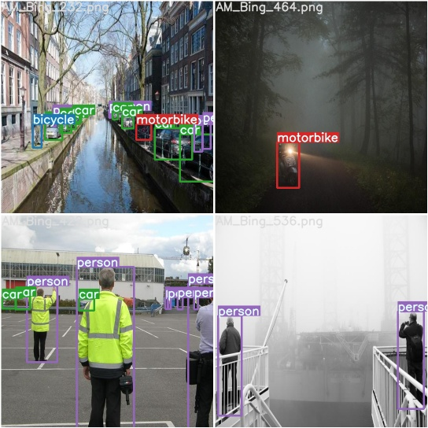</td>
        <td>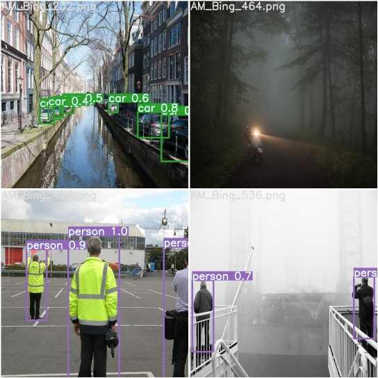</td>
        <td>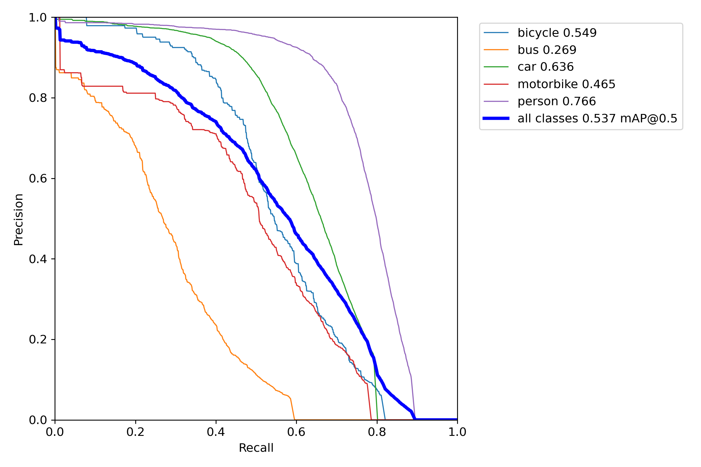</td>
        <td>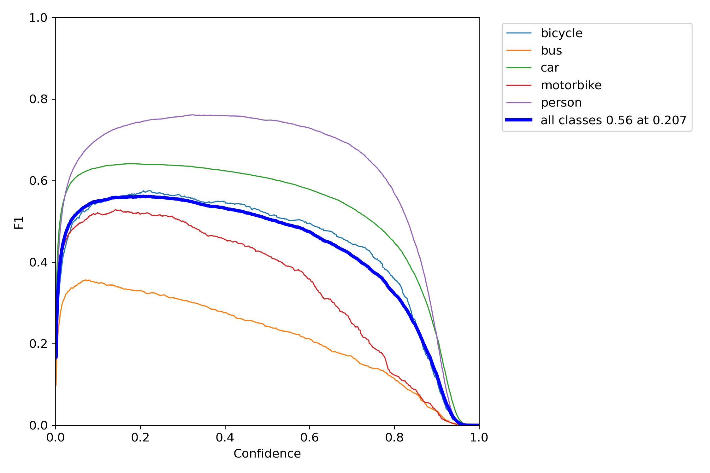</td>
    </tr>

    <tr>
        <td colspan="4"> TransWeatherYoloV3 </td>
    </tr>
    <tr>
        <td></td>
        <td></td>
        <td>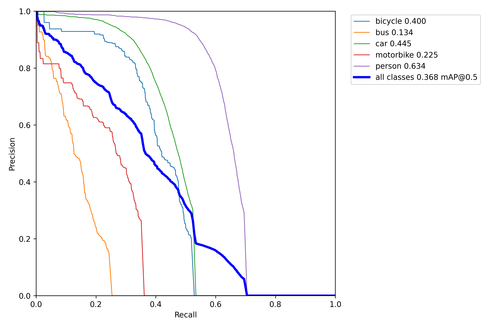</td>
        <td></td>
    </tr>

        <tr>
        <td colspan="4"> YoloV6 </td>
    </tr>
    <tr>
        <td></td>
        <td>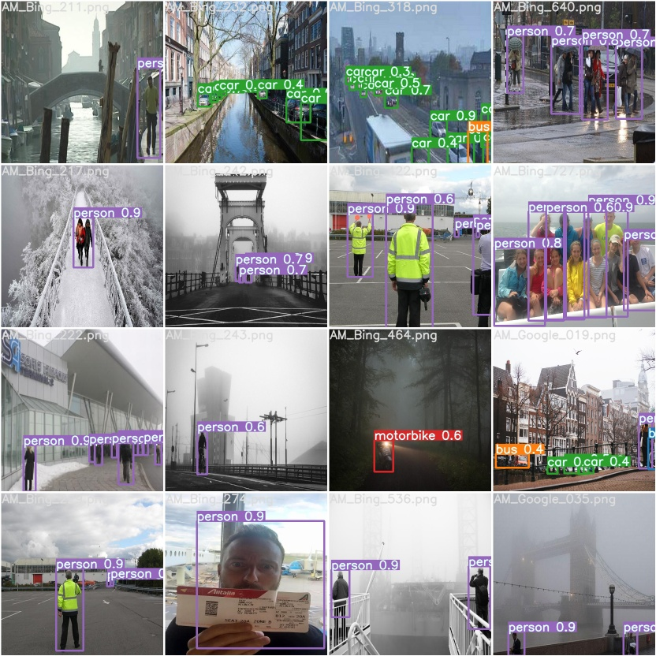</td>
        <td>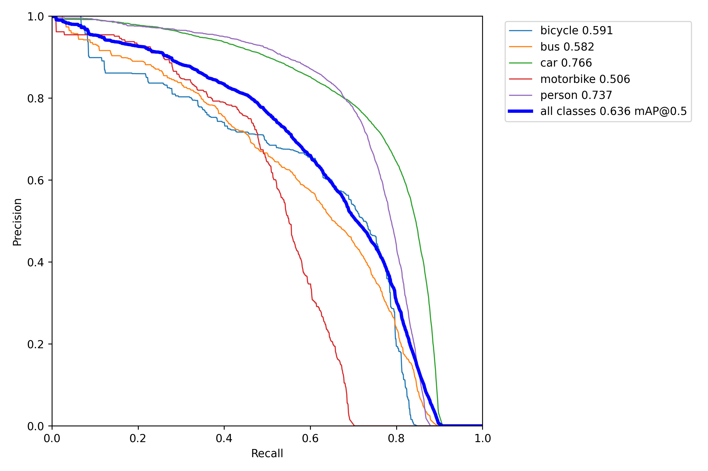</td>
        <td>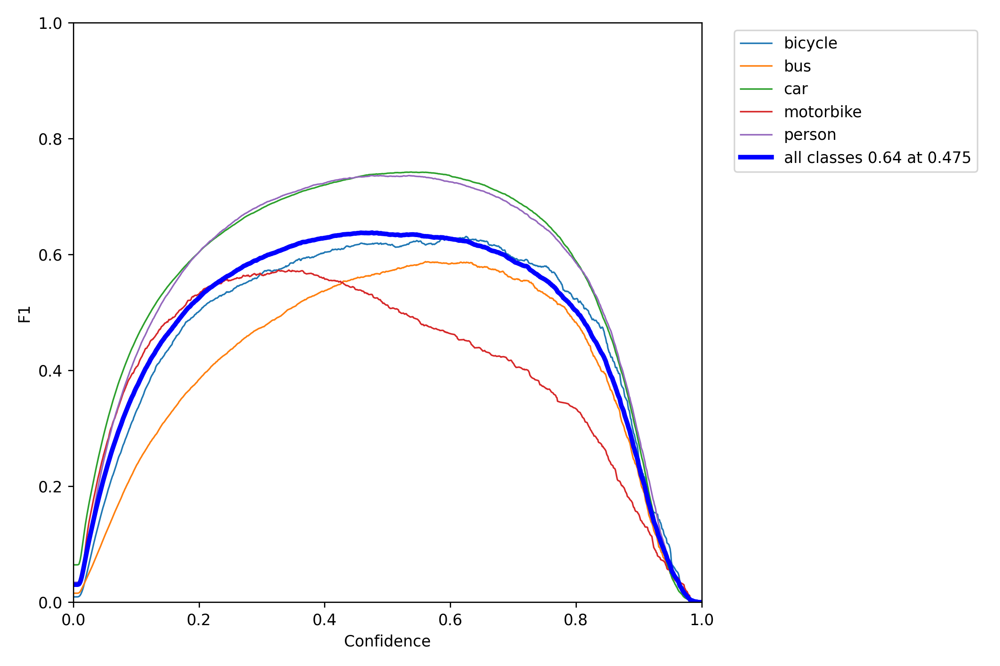</td>
    </tr>

    <tr>
        <td colspan="4"> DEYolov6 </td>
    </tr>
    <tr>
        <td></td>
        <td>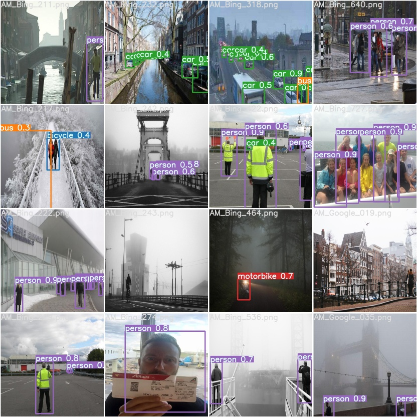</td>
        <td>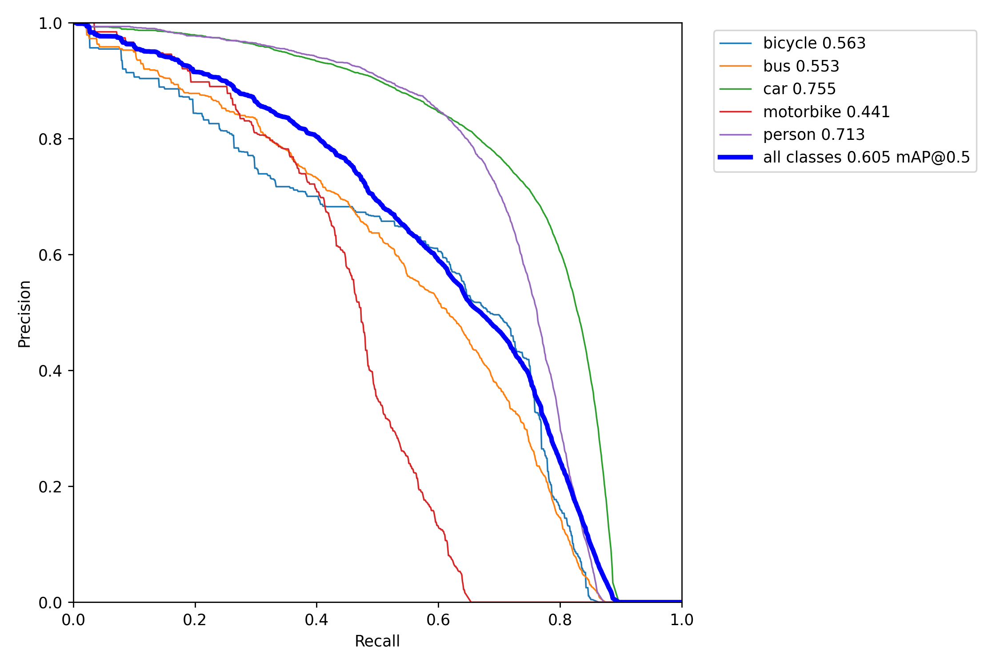</td>
        <td>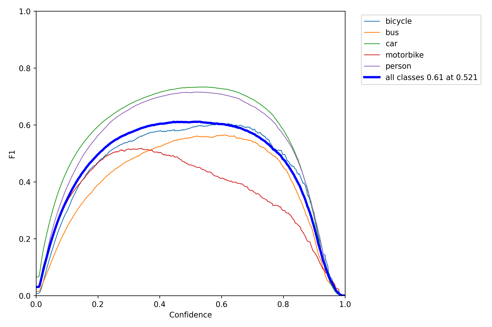</td>
    </tr>

    <tr>
        <td colspan="4"> TransWeatherYolov6 </td>
    </tr>
    <tr>
        <td></td>
        <td>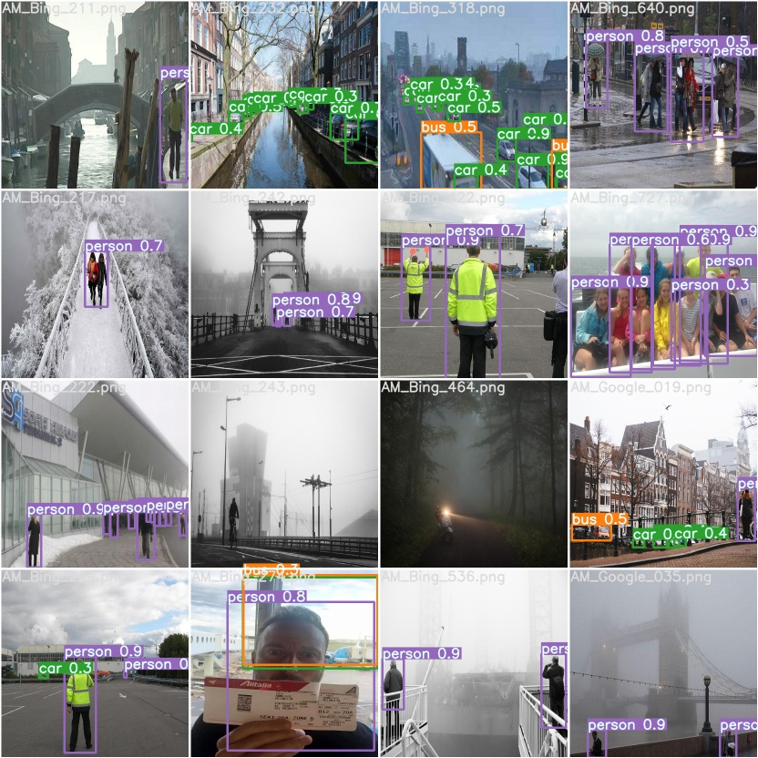</td>
        <td>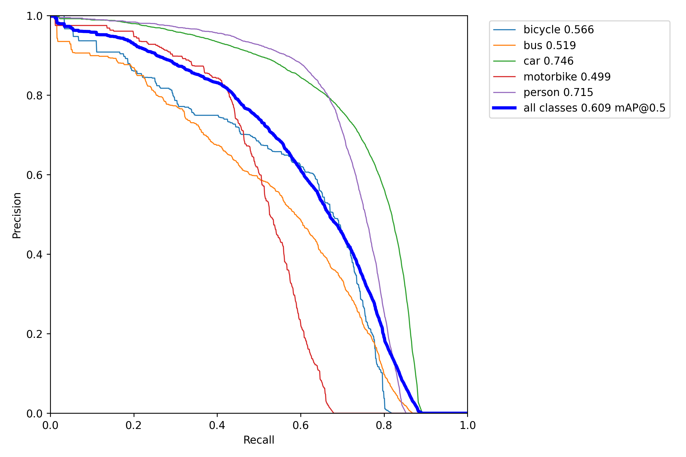</td>
        <td>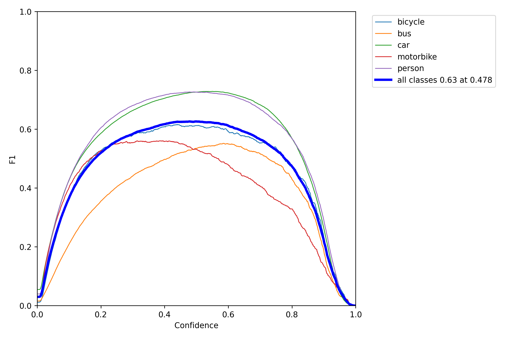</td>
    </tr>


 </table>

### Summary

| Enhancement Module  | Detection Module   | mAP@0.5       | F1 Score | Time/ms |
| --------------------| -------------------| --------------| ---------| --------|
|        -            | YOLOv3             | 0.279         | 0.43     | 34.4    |
|        -            | YOLOv6             | 0.499         | 0.57     | 12.3    |
|        -            | YOLOv7             |               |          |         |
| DENet               | YOLOv3             | 0.299         | 0.45     | 45.3    |
| DENet               | YOLOv6             | 0.521         | 0.59     | 23.4    |
| DENet               | YOLOv7             |               |          |         |
| TransWeather        | YOLOv3             | 0.196         | 0.32     | 73.7    |
| TransWeather        | YOLOv6             | 0.456         | 0.53     | 51.5    |
| TransWeather        | YOLOv7             |               |          |         |

## Usage

To reproduce the results of the comparative analysis run the following commands:
```
    git clone https://github.com/Ahmedh12/GP_Code_Base.git
    cd GP_Code_Base
    pip install -r requirements.txt
    python test.py
```

## Contributer

- [Ahmed Hussien](https://github.com/Ahmedh12)
- [Khaled El-lethy](https://github.com/SandraHany)
- [Millania Sameh](https://github.com/MillaniaSameh)
- [Sandra Hany](https://github.com/SandraHany)
